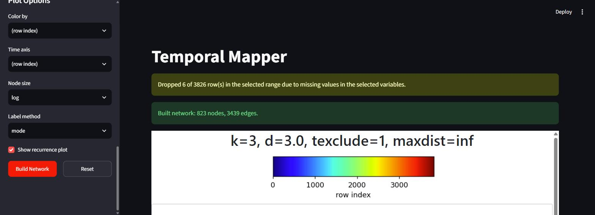
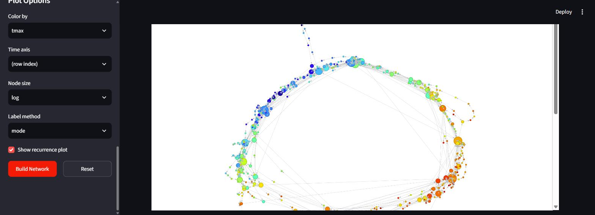
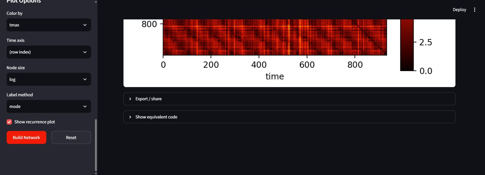

# Interactive App

`app/streamlit_app.py` is a point-and-click front end for the same
`tknndigraph` → `filtergraph` → plotting pipeline the
[Quickstart](quickstart.md) walks through in code. Load data, pick variables,
turn the parameters, and explore the resulting network in your browser —
without writing anything.

Everything on the [Concepts](concepts.md) page about what the parameters
*mean* applies unchanged; this page only covers driving the app.


/// caption
After a build: the missing-data notice and the result summary, above the plots.
///


/// caption
The interactive network, built from the bundled weather data and coloured by
`tmax`. The seasonal cycle shows up directly as a loop running cold (blue)
through warm (red) and back. Nodes are draggable, the view zooms and pans, and
hovering a node reports its member count and colour value.
///


/// caption
Below it, the geodesic recurrence plot, with the **Export / share** and **Show
equivalent code** panels beneath. The repeating block structure is the same
seasonal recurrence seen as a loop in the network above.
///

## Install and launch

The app's dependencies live in an optional extra:

```bash
pip install -e ".[app]"     # streamlit + matplotlib + igraph + pyvis
```

Then, from the repository root:

```bash
streamlit run app/streamlit_app.py
```

A browser tab opens automatically on `localhost:8501`. Stop it with `Ctrl+C`.

!!! tip "Opening it on another device"
    Add `--server.address 0.0.0.0` and visit `http://<your-machine-ip>:8000`
    from a phone or tablet on the same network. You may need to allow the
    port through your firewall.

## The sidebar, top to bottom

### Data

**Load sample data** uses the bundled `sampledata/EL_temp.csv`, trimmed to the
same recent slice as the Quickstart. **Upload** takes any CSV or TXT.

Only numeric columns are offered as build variables. A leading unnamed column
— pandas' `Unnamed: 0`, the usual leftover from a `to_csv()` without
`index=False` — is dropped automatically, since it is just a monotonic ramp
and would dominate the distance computation if selected.

!!! warning "The bundled CSV is the full historical record"
    `EL_temp.csv` holds 57 709 daily rows. The pipeline builds a full pairwise
    distance matrix, which is O(N²) — at that size roughly **27 GB**. The
    sample button therefore trims to a recent slice, and the app refuses any
    row range large enough to be a problem, telling you the figure and how to
    fix it. Restrict the row range or turn on downsampling.

### Variables & Preprocessing

| Control | Effect |
| --- | --- |
| **Variables** | Which numeric columns define the system's state. |
| **z-score** | On by default. Uses `ddof=1`, matching MATLAB's convention (see [Concepts](concepts.md)). |
| **start row / end row** | Restrict to a window. 0-indexed, following this port's convention — *not* the MATLAB app's 1-indexed fields. `end row` accepts `last`. |
| **downsample (N)** | Keep every Nth row. A lowpass is applied first — see below. |
| **embed lag / embed order** | Optional [delay embedding](quickstart.md#step-2-optional-delay-embedding). Order `1` skips it. |

### Network Parameters

`k`, `d`, `texclude`, the two `max dist` cutoffs, and `reciprocal` — all
exactly as described in the
[Quickstart](quickstart.md#step-4-build-the-spatiotemporal-graph). `max dist`
accepts `inf`.

### Plot Options

Color/time variable, node size mode, label method, and whether to show the
recurrence plot. **Changing any of these re-renders the existing network
rather than rebuilding it**, so it is cheap to click through them freely once
a build has finished.

## Two things handled for you

!!! note "Missing data is dropped, not ignored"
    Rows with a missing value in any selected variable are removed before
    building, and the app reports exactly how many. This matters more than it
    sounds: `NaN` propagates through z-scoring and then through the entire
    distance matrix, so an unremoved gap silently degrades the whole network
    rather than failing loudly. Dropping happens *before* the downsampling
    lowpass, so a gap cannot smear into neighbouring samples.

    Calling `tknndigraph` directly on data containing `NaN` raises an error
    instead — the scripted API expects you to clean your own data.

!!! note "Downsampling filters before it strides"
    `downsample (N) > 1` applies a centered rolling mean of width N before
    keeping every Nth row. Naively taking every Nth raw sample would alias
    high-frequency content into spurious low-frequency structure.

## Export / share

After a build, the **Export / share** panel offers:

**Figures**

- **Interactive network (`.html`)** — a fully self-contained page. It stays
  draggable, zoomable, and hoverable with no Python, no install, and no
  internet, so it can simply be emailed or dropped in a shared folder.
- **Recurrence plot (`.png`)** and **Network figure (`.png`)** at 200 dpi. The
  static network render is behind a checkbox because it re-runs the layout;
  it uses the same layout routine as the interactive view, so the two agree.

**Data for downstream analysis**

- **`timeline.csv`** — one row per retained time point: `tidx`, `source_row`,
  `node`, plus your chosen color/time columns. This is the join-back table —
  *which attractor was the system in at time t* — and is what dwell-time,
  transition-rate, and occupancy analyses actually need.
- **`network.graphml`** — topology, edge weights, and per-node attributes.
  Opens in Gephi and Cytoscape, round-trips through `networkx.read_graphml`.
- **`params.json`** — full provenance: the data source and its loading code,
  every preprocessing and network setting (including the *resolved*
  `max_neighbor_dist` and how many rows were dropped), every plot option, and
  the resulting network's shape.
- **Everything (`.zip`)** — all of the above plus the interactive page and a
  `reproduce.py`.

!!! note "Why the distance matrices aren't exported"
    Neither the geodesic recurrence matrix nor `D_simp` is included. Both are
    O(n²) — the recurrence matrix alone is ~120 MB on the sample data — and
    both are one line to regenerate from the exported files
    (`tcm_distance(g_simp, members)`, and `filtergraph`'s fourth return
    value). The exports keep only what cannot be cheaply recomputed.

## Show equivalent code

The panel below the plots holds a complete, runnable script reproducing the
current build — including the data-loading step and the exact resolved
parameters. This is the bridge back to scripting: explore interactively, then
paste the script into your own analysis once the parameters look right. It is
the same file the ZIP ships as `reproduce.py`.

## What's next

- [Quickstart](quickstart.md) — the same pipeline, written out step by step.
- [Concepts & coming from MATLAB](concepts.md) — what the network means.
- [API Reference](api.md) — every function the app calls.
