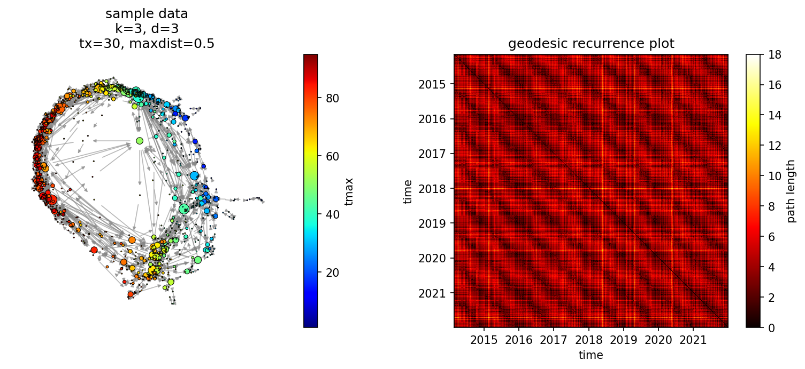

# tmapper (Python)

**tmapper** is a Python port of [Temporal Mapper 2](https://github.com/Multiscale-Complex-Systems-Lab/tmapper2),
a toolbox that turns time-series data into an **attractor transition network** —
a compact graph that captures the stable states of a dynamical system and the
transitions between them, using nothing but the time series itself.

It generalizes the original, fMRI-specific
[Temporal Mapper](https://github.com/Multiscale-Complex-Systems-Lab/tmapper/)
into a general-purpose tool for characterizing complex dynamics across
disciplines and data types.

/// caption
An attractor transition network built by tmapper from historical East Lansing
weather data. You will reproduce this figure in the [Quickstart](quickstart.md).
///

!!! note "Coming from the MATLAB toolbox?"
    This is a from-scratch Python port, not a wrapper. See
    [Concepts & coming from MATLAB](concepts.md) for a function-by-function
    mapping and the handful of behavioral differences worth knowing about.

## What it produces

Given a time series, tmapper returns a directed graph in which:

- each **node** is an attractor (a stable state the system settles into),
- the **size** of a node reflects the local stability of that attractor (how many time points collapse into it), and
- each **edge** is an observed transition from one attractor to another.

## How it works

Under the hood the computation is a two-step pipeline:

!!! note "Step 1 — spatiotemporal neighborhood graph"
    Starting from a pairwise **distance matrix** `D` between all time points,
    [`tknndigraph`](api.md#tmapper.tknndigraph) builds a directed *k*-nearest-neighbor
    graph with one node per time point, adding back the temporal (t → t+1)
    links so the flow of time is preserved.

!!! note "Step 2 — simplified transition network"
    [`filtergraph`](api.md#tmapper.filtergraph) contracts time points that sit
    within a distance `d` of each other into a single node. The connected
    components become the nodes of the final attractor transition network.

Two parameters do most of the work: **`k`** (how many spatial neighbors each
time point may have) and **`d`** (the compression threshold — loops shorter
than this are absorbed into a node). The [Quickstart](quickstart.md) walks
through both on real data.

A secondary toolkit (cycle counting/clustering, path decomposition,
modularity) is also included for probing the topology of the resulting
network — see the [API Reference](api.md).

Besides the static `plot_tmgraph`/`plot_tmgraph_tcm` figures, dense networks
can also be explored as a draggable/zoomable/hoverable HTML page via
`plot_tmgraph_interactive` — see the [Quickstart](quickstart.md#step-7-explore-interactively-optional).

## Where to go next

- **[Installation](installation.md)** — install the package and check dependencies.
- **[Quickstart](quickstart.md)** — build your first transition network end to end, reproducing the figure above.
- **[Concepts & coming from MATLAB](concepts.md)** — what the nodes, edges, and loops mean, and how the Python API maps onto the MATLAB one.
- **[API Reference](api.md)** — full documentation for every function, generated from the source.

## Citation

If you use this toolbox in your work, please cite:

> Zhang, M., Chowdhury, S., & Saggar, M. (2023).
> [Temporal Mapper: transition networks in simulated and real neural dynamics](https://doi.org/10.1162/netn_a_00301).
> *Network Neuroscience*, 7(2): 431–460.
